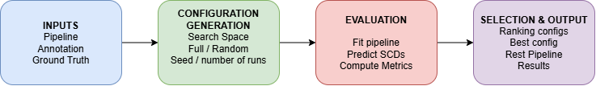

# Reproducing the Synthetic Benchmark

This directory contains the code used to generate the synthetic datasets and run the benchmark experiments reported in the paper.

The notebooks are **research and reproducibility code**, not part of the `polartox` package. The package provides the implementation, while the notebooks demonstrate the complete workflow used to generate data, select the Polarized Trees configuration, and run the final inference.

## Benchmark Workflow

The complete benchmark procedure is illustrated below.

The benchmark consists of four main stages:

1. **Inputs** — a `PolarizedTreesPipeline`, annotation data, and ground truth.
2. **Configuration Generation** — configurations are generated from the selected search space using either full or random search.
3. **Evaluation** — each configuration is fitted, used to predict active SCD dimensions, and evaluated against the available ground truth using the requested metrics.
4. **Selection & Output** — configurations are ranked, the best configuration and pipeline are identified, and the benchmark results are reported and saved.

Ground truth is required for recovery-based model selection. Once the best configuration has been selected, the resulting pipeline can be applied to new annotation data without ground truth.

## Notebooks

There are two notebooks.

### `datasetdemo.ipynb`

This notebook generates the synthetic benchmark datasets.

It:

- generates the synthetic annotation datasets;
- creates the corresponding ground truth;
- checks the generated distributions and nDFU;
- saves the datasets and ground truth for later use.

The datasets are generated **once** and reused throughout the benchmark, so all configurations are evaluated on the same data.

### `treesbenchmark.ipynb`

This notebook performs the complete benchmark workflow shown above.

It:

- loads the fixed synthetic datasets;
- defines the benchmark inputs;
- runs `PolarizedTreesBenchmark`;
- searches the paper's hyperparameter space;
- selects the best configuration using the synthetic ground truth;
- evaluates the selected configuration on the individual benchmark corpora;
- runs the selected pipeline on an unseen corpus without ground truth;
- reports the resulting F, C, and P outputs;
- saves the benchmark and inference results.

The `treesbenchmark.ipynb` notebook serves **two purposes**: it is a runnable demonstration of the `PolarizedTreesBenchmark` API, and it is also the actual experimental workflow used to obtain the configurations and results reported in the paper.

## What Can Be Changed?

The benchmark is not restricted to the settings used in the paper. Users can customize:

- **search space** — the hyperparameter configurations considered;
- **strategy** — `full` to evaluate all configurations or `random` to sample a fixed number;
- **number of runs** — the number of configurations sampled with random search;
- **seed** — for reproducible random sampling;
- **metrics** — e.g. Jaccard, precision, recall, and exact match;
- **selection metric** — the metric used to select the best configuration;
- **selection direction** — whether higher or lower values are preferred;
- **pipeline settings** — including dimensions and scale;
- **annotations and ground truth** — allowing the benchmark to be used with other datasets.

The package default search space corresponds to the paper and contains **3,240 valid configurations**. For the reported benchmark, **800 configurations are randomly sampled** and ranked according to mean Jaccard across the three synthetic benchmark corpora.

The default settings can be replaced with a custom search space, evaluation strategy, metrics, and selection criterion for other experiments.

## From Benchmark to Inference

The synthetic benchmark provides known ground truth, allowing configuration quality to be measured directly.

The workflow is:

    Synthetic annotations + ground truth
                    ↓
           Configuration search
                    ↓
           Recovery evaluation
                    ↓
           Best configuration
                    ↓
            Best Polarized Trees
                 pipeline
                    ↓
     New annotation data without ground truth
                    ↓
                F, C, P

This separates **model selection**, which uses known ground truth in the synthetic setting, from **inference**, where the selected pipeline is applied to data for which the true active dimensions are unknown.

## Repository Structure

The notebooks assume the following structure:

    project/
    ├── benchmark_config.py
    │
    ├── benchmark_data/
    │   ├── A_default_dataset.csv
    │   ├── A_default_ground_truth.json
    │   ├── B_weak_signal_dataset.csv
    │   ├── B_weak_signal_ground_truth.json
    │   ├── C_deep_dataset.csv
    │   ├── C_deep_ground_truth.json
    │   ├── inference_unseen_dataset.csv
    │   └── inference_unseen_ground_truth.json
    │
    ├── benchmark_results/
    │   └── ...
    │
    └── notebooks/
        ├── datasetdemo.ipynb
        └── treesbenchmark.ipynb

## Running the Benchmark

Run the notebooks in order:

    datasetdemo.ipynb
            ↓
    benchmark_data/
            ↓
    treesbenchmark.ipynb
            ↓
    benchmark_results/

First run `datasetdemo.ipynb` to generate the fixed synthetic datasets.

Then run `treesbenchmark.ipynb` to reproduce the benchmark, select the best configuration, and run the final inference.

The full benchmark can be computationally expensive because it evaluates a large hyperparameter search. Existing results can be inspected without rerunning the complete search.

## Outputs

`treesbenchmark.ipynb` saves:

- results for the evaluated configurations;
- the selected best configuration;
- the best score;
- the top-performing configurations;
- recovery results for the selected configuration on A/B/C;
- inference outputs **F**, **C**, and **P**;
- inference diagnostics;
- benchmark and inference reports.

These outputs provide the reproducible record of both **model selection** and **final inference**.

## Next Steps

1. Run `datasetdemo.ipynb` to generate the fixed synthetic datasets.
2. Run `treesbenchmark.ipynb` to reproduce the benchmark and model selection.
3. Inspect `benchmark_results/` for the selected configuration and evaluation results.
4. For a different experiment, modify the search space, strategy, metrics, or other benchmark settings and rerun the notebook.
5. For new annotation data, use the selected pipeline for ground-truth-free inference and inspect its **F**, **C**, and **P** outputs and diagnostics.
