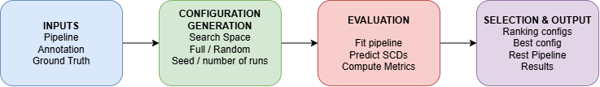

# Reproducing the Synthetic Benchmark

This directory contains the code used to generate the synthetic datasets and run the benchmark experiments reported in the paper.

The notebooks are **research and reproducibility code**, not part of the `polartox` package. The package provides the implementation, while the notebooks demonstrate the complete workflow used to generate data, select the Polarized Trees configuration, and run the final inference.

## Benchmark Workflow

The complete benchmark procedure is illustrated below.

The benchmark consists of four main stages:

1. **Inputs** — a `PolarizedTreesPipeline`, annotation data, and ground truth.
2. **Configuration Generation** — configurations are generated from the selected search space using either full or random search.
3. **Evaluation** — each configuration is fitted, used to predict active SCD dimensions, and evaluated against the available ground truth using the requested metrics.
4. **Selection & Output** — configurations are ranked, the best configuration and pipeline are identified, and the benchmark results are reported and saved.

Ground truth is required for recovery-based model selection. Once the best configuration has been selected, the resulting pipeline can be applied to new annotation data without ground truth.

## Notebooks

There are three notebooks, run in this order: `datasetdemo.ipynb`, `treesbenchmark.ipynb`, `pegcomparison.ipynb`.

What the notebooks share lives in [`benchmark_config.py`](benchmark_config.py): the corpus settings, the data and results folders (`DATA_DIR`, `RESULTS_DIR`), `load_corpus` / `load_benchmark_corpora` (read the saved datasets), and `check_polartox()` (prints which `polartox` and library versions are running, and stops if it is not the current package). Each notebook only has to find that file first.

### `datasetdemo.ipynb`

This notebook generates the synthetic benchmark datasets.

It:

- generates the synthetic annotation datasets;
- creates the corresponding ground truth;
- checks the generated distributions and nDFU;
- saves the datasets and ground truth for later use.

The datasets are generated **once** and reused throughout the benchmark, so all configurations are evaluated on the same data.

### `treesbenchmark.ipynb`

This notebook runs the hyperparameter search and saves its results. It stops there.

It:

- loads the fixed synthetic datasets;
- defines the benchmark inputs;
- runs `PolarizedTreesBenchmark` over the paper's hyperparameter space, with recovery measured against the synthetic ground truth;
- saves the complete results, the report, the top 20 configurations (`top_configurations.csv`), and a summary of which PEG formulations the top 20 use (`top20_formulations.csv`).

It serves **two purposes**: it is a runnable demonstration of the `PolarizedTreesBenchmark` API, and it is the experimental workflow used to select the configurations reported in the paper.

### `pegcomparison.ipynb`

This notebook shows how the PEG formulations change the trees.

It:

- opens the top-20 table saved by `treesbenchmark.ipynb` and lets you choose rows by position;
- keeps every setting of a chosen row fixed except the PEG formulation, and runs all five (`max`, `avg`, `min`, `mean`, `harmonic`) on the three benchmark corpora and on the unseen corpus;
- gives one **overview** per formulation: recovery (checked against the benchmark's own saved numbers) and tree shape (retention, leaves, depth, annotators per leaf, residual nDFU, top-split PEG, indeterminate leaves);
- splits recovery **by the true number of active dimensions** of each text (k), which is where the formulations differ most;
- computes the **ARI** between formulations, overall and by k: whether two of them split the annotators of a text into the same groups;
- shows F, C and P for every formulation on the unseen corpus;
- shows **the same text under every formulation**: the texts on which the formulations disagree most, with the true structure, a one-line summary per formulation and the trees themselves;
- saves everything to `benchmark_results/peg_comparison/`.

## What Can Be Changed?

The benchmark is not restricted to the settings used in the paper. Users can customize:

- **search space** — the hyperparameter configurations considered;
- **strategy** — `full` to evaluate all configurations or `random` to sample a fixed number;
- **number of runs** — the number of configurations sampled with random search;
- **seed** — for reproducible random sampling;
- **metrics** — e.g. Jaccard, precision, recall, and exact match;
- **selection metric** — the metric used to select the best configuration;
- **selection direction** — whether higher or lower values are preferred;
- **pipeline settings** — including dimensions and scale;
- **annotations and ground truth** — allowing the benchmark to be used with other datasets;
- **parallelism** — `n_jobs` worker processes (`-1` for all CPUs);
- **checkpointing** — `checkpoint_dir` and `checkpoint_every` save progress, so an interrupted search resumes where it stopped;
- **per-corpus evaluation** — `text_groups` maps each text to a corpus; metrics are computed per corpus and averaged with equal weight per corpus, which is how `treesbenchmark.ipynb` combines the A, B and C corpora;
- **per-text results** — `keep_text_results` keeps the raw per-text recovery values (e.g. for boxplots).

The package default search space contains **3,240 valid configurations**: 648 settings of the other hyperparameters times the five PEG formulations (`max`, `avg`, `min`, `mean`, `harmonic`). For the reported benchmark, **800 configurations are randomly sampled** and ranked according to mean Jaccard across the three synthetic benchmark corpora.

The default settings can be replaced with a custom search space, evaluation strategy, metrics, and selection criterion for other experiments.

## From Benchmark to Inference

The synthetic benchmark provides known ground truth, allowing configuration quality to be measured directly.

The workflow is:

    Synthetic annotations + ground truth
                    ↓
           Configuration search
                    ↓
           Recovery evaluation
                    ↓
           Best configuration
                    ↓
            Best Polarized Trees
                 pipeline
                    ↓
     New annotation data without ground truth
                    ↓
                F, C, P

This separates **model selection**, which uses known ground truth in the synthetic setting, from **inference**, where the selected pipeline is applied to data for which the true active dimensions are unknown.

## Repository Structure

The notebooks assume the following structure:

    project/
    ├── benchmark_config.py
    │
    ├── benchmark_data/
    │   ├── A_default_dataset.csv
    │   ├── A_default_ground_truth.json
    │   ├── B_weak_signal_dataset.csv
    │   ├── B_weak_signal_ground_truth.json
    │   ├── C_deep_dataset.csv
    │   ├── C_deep_ground_truth.json
    │   ├── inference_unseen_dataset.csv
    │   └── inference_unseen_ground_truth.json
    │
    ├── benchmark_results/
    │   ├── ...                       (written by treesbenchmark.ipynb)
    │   └── peg_comparison/           (written by pegcomparison.ipynb)
    │
    ├── synthetic_benchmark_bundle/   (and a .zip of it: a copy of benchmark_data/
    │                                  for sharing, created by datasetdemo.ipynb)
    │
    └── notebooks/
        ├── datasetdemo.ipynb
        ├── treesbenchmark.ipynb
        └── pegcomparison.ipynb

## Running the Benchmark

Run the notebooks in order:

    datasetdemo.ipynb
            ↓
    benchmark_data/
            ↓
    treesbenchmark.ipynb
            ↓
    benchmark_results/   (top_configurations.csv, ...)
            ↓
    pegcomparison.ipynb
            ↓
    benchmark_results/peg_comparison/

First run `datasetdemo.ipynb` to generate the fixed synthetic datasets.

Then run `treesbenchmark.ipynb` to reproduce the search and save the top configurations, and finally `pegcomparison.ipynb` to compare the PEG formulations on them.

The full benchmark can be computationally expensive because it evaluates a large hyperparameter search. Existing results can be inspected without rerunning the complete search.

> **Note.** The search results in `benchmark_results/` (`benchmark_*.csv`, `benchmark_report.json`, `top_configurations.csv`, `top20_formulations.csv`) come from the current search (800 random configurations of the 3,240, seed 0). A few older files from the earlier version of the notebook are still in that folder (`selected_configuration*`, `fcp_*`, `summary_results_extra.csv`); they come from the earlier search and are not produced by the current notebooks.

## Outputs

`treesbenchmark.ipynb` saves, in `benchmark_results/`:

- results for the evaluated configurations (`benchmark_configuration_summary.csv`, `benchmark_results.csv`, `benchmark_text_results.csv`);
- the report, with the settings, the search space, the best configuration and the top configurations (`benchmark_report.json`);
- the top 20 configurations (`top_configurations.csv`);
- how many of the top 20 use each PEG formulation (`top20_formulations.csv`).

`pegcomparison.ipynb` saves, in `benchmark_results/peg_comparison/`:

- the chosen settings (`selected_settings.csv`);
- every number of every run and corpus (`per_run.csv`), the overview table (`overview_A_B_C.csv`) and the by-k tables (`recovery_by_k.csv`, `ari_by_k.csv`);
- the ARI between formulations, as matrices and per text (`ari_*.csv`);
- the inference outputs **F**, **C** and **P** for every formulation (`F_*.csv`, `C_*.csv`, `P_*.csv`).

These outputs provide the reproducible record of **model selection** and of the **PEG comparison**.

## Next Steps

1. Run `datasetdemo.ipynb` to generate the fixed synthetic datasets.
2. Run `treesbenchmark.ipynb` to reproduce the search and save the top configurations.
3. Run `pegcomparison.ipynb` to compare the PEG formulations on the best configurations.
4. Inspect `benchmark_results/` and `benchmark_results/peg_comparison/`.
5. For a different experiment, modify the search space, strategy, metrics, or other benchmark settings and rerun the notebooks.
6. For new annotation data, use a chosen pipeline for ground-truth-free inference and inspect its **F**, **C**, and **P** outputs and diagnostics.
