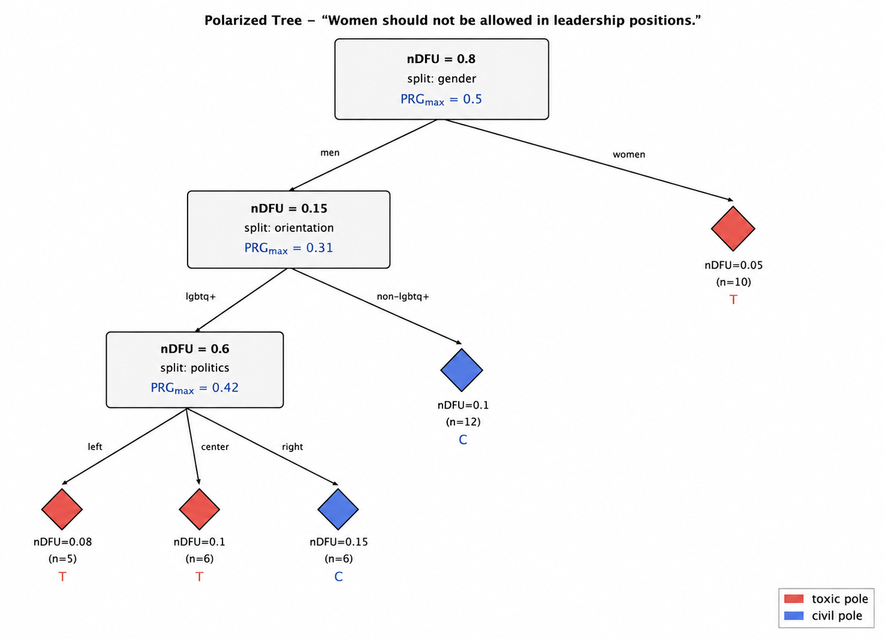

# `polartox.polarized_trees` — Polarized Trees

`polartox.polarized_trees` identifies demographic dimensions and
intersectional subgroups that explain polarization in annotation data.

Starting from the ratings for one text, Polarized Trees recursively partitions
annotators using the demographic dimension that gives the largest reduction
in polarization. The resulting trees provide an interpretable explanation of
where disagreement comes from.

For a detailed description of the method, mathematical definitions, and the
experimental validation, see **`polarized_trees.pdf`**.

## Install

```bash
pip install polartox
```

`ndfu` is installed as a core dependency and provides the DFU/nDFU scoring
used by the method.

## Quickstart

```python
from polartox.polarized_trees import PolarizedTreesPipeline

pipe = PolarizedTreesPipeline(
    dims=["gender", "politics", "age", "education", "orientation"],
    scale=5,
    theta_filter=0.3,
    min_size_frac=0.03,
    max_depth=8,
    variant="beta",
    beta=1.0,
    h=0.15,
    relative_h=True,
    theta_stop=0.10,
)

results = pipe.run_full_evaluation(dataset)

results["F"]            # Dimension frequency
results["C"]            # Subgroup pole consistency
results["P"]            # Subgroup PRG
results["diagnostics"]  # Inference diagnostics
```

When synthetic ground truth is available, it can also be supplied:

```python
results = pipe.run_full_evaluation(
    dataset,
    ground_truth=ground_truth,
)

results["recovery"]
```

The recovery output contains Jaccard, precision, recall, and exact-match
scores. These are for synthetic validation only; real datasets do not have
known ground truth.

## How it works

For each text, the method follows the same basic process:

1. **Measure polarization.**  
   nDFU is computed for the full annotation distribution.

2. **Filter texts.**  
   Only texts whose nDFU exceeds `theta_filter` are analyzed.

3. **Find the best split.**  
   Candidate demographic dimensions are scored using Polarization Reduction
   Gain (PRG). The dimension with the strongest reduction is selected.

4. **Grow the tree.**  
   The process is repeated recursively, producing increasingly specific
   intersectional subgroups. A dimension already used on a branch is not
   reused on that branch.

5. **Stop and label leaves.**  
   Splitting stops when the subgroup is too small, the remaining polarization
   is too low, the gain is insufficient, the maximum depth is reached, or
   no dimensions remain. Terminal subgroups are labelled as `toxic`, `civil`,
   or `indeterminate`.

6. **Summarize the corpus.**  
   The resulting trees are aggregated into Dimension Frequency (F), Subgroup
   Pole Consistency (C), and Subgroup PRG (P).



The important intuition is that the method does not only ask **whether a text
is polarized**. It asks **which demographic dimensions and subgroups explain
that polarization**.

## Main outputs

### Dimension Frequency (F)

Shows how often each demographic dimension is selected at each tree depth.
Dimensions appearing near the root explain larger portions of the observed
polarization, while deeper dimensions refine the explanation.

### Subgroup Pole Consistency (C)

Shows how consistently an intersectional subgroup is associated with the
`toxic` or `civil` pole across texts.

### Subgroup PRG (P)

Shows the average polarization reduction associated with a subgroup's split.
Higher values indicate a stronger contribution to the discovered explanation.

### Diagnostics

`diagnostics()` provides corpus-level information such as retention rate,
tree size, residual nDFU, top-split PRG, indeterminate leaves, and dimensions
that were never selected.

These diagnostics are particularly useful for real data, where ground truth
is unavailable.

## Main parameters

| Parameter | Role |
|---|---|
| `dims` | Candidate demographic dimensions |
| `scale` | Rating scale |
| `theta_filter` | Minimum nDFU required to analyze a text |
| `min_size_frac` | Minimum subgroup size relative to the text |
| `max_depth` | Maximum tree depth |
| `variant` | PRG formulation: `max`, `var`, or `beta` |
| `beta` | Controls the PRGβ formulation |
| `h` | Minimum required polarization reduction |
| `relative_h` | Expresses `h` relative to the node's remaining polarization |
| `theta_stop` | Stops splitting when remaining polarization is already low |

The configuration used in the paper was selected through model selection on
the synthetic benchmark rather than being an inherent fixed property of the
method. The selected configuration and the benchmark results are described
in `polarized_trees.pdf`.

## Synthetic validation vs. real inference

Synthetic data provides known active dimensions, so the method can be
evaluated directly against the generating ground truth.

```text
Synthetic data
      ↓
Polarized Trees
      ↓
Recovered dimensions
      ↓
Compare with ground truth
```

For real annotation data, the true causes are unknown:

```text
Real annotation data
      ↓
Polarized Trees
      ↓
Trees + F/C/P + diagnostics
```

Thus, recovery metrics are a validation tool for synthetic experiments, while
F, C, P, and the diagnostics are the relevant outputs during inference.

## Demo

See `trees_demo.ipynb` for a short walkthrough of the complete workflow:

**annotation data → Polarized Trees → individual tree → F/C/P → recovery
evaluation → inference without ground truth**

The demo is intentionally compact and focuses on understanding the method
rather than reproducing the full benchmark.

## Further reading

For the full methodology, PRG definitions, stopping criteria, hyperparameter
selection, synthetic benchmark, recovery results, inference diagnostics, and
limitations, see **`polarized_trees.pdf`**.
